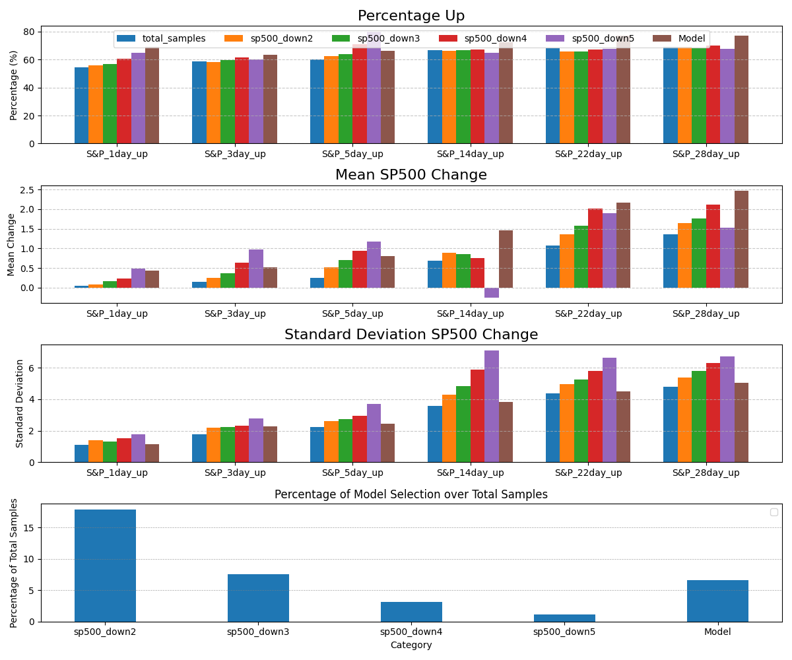

**Mode Evaluation**
--------------
Accuracy is the proportion of correct predictions out of the total number of predictions. It is calculated as the ratio of correctly classified instances to the total number of instances.
Precision is the ratio of true positives (correctly predicted positive instances) to the sum of true positives and false positives (incorrectly predicted positive instances).
Recall is the ratio of true positives to the sum of true positives and false negatives (incorrectly predicted negative instances).
F1 Score is the harmonic mean of precision and recall. It provides a balanced measure of the model's performance, taking into account both precision and recall.
ROC AUC (Receiver Operating Characteristic Area Under the Curve) is a metric used to evaluate the performance of binary classification models. It measures the ability of the model to distinguish between positive and negative classes. A higher ROC AUC score indicates better performance.

    explain this result:
    Logistic Regression Accuracy: 55.68%
                precision    recall  f1-score   support

            0       0.48      0.37      0.42        38
            1       0.59      0.70      0.64        50

        accuracy                           0.56        88
    macro avg       0.54      0.53      0.53        88
    weighted avg       0.55      0.56      0.55        88

        This result is a classification report for a logistic regression model. Here's a breakdown of what each part means:

        **Accuracy:** 55.68%

        * This is the overall accuracy of the model, which means that the model correctly predicted 55.68% of the samples.

        **Classification Report:**

        * **Class 0:** This refers to the first class in the classification problem (e.g. "not buying" or "not responding").
            + **Precision:** 0.48
                - This means that out of all the samples that the model predicted as class 0, 48% of them were actually class 0.
            + **Recall:** 0.37
                - This means that out of all the actual class 0 samples, the model correctly predicted 37% of them as class 0.
            + **F1-score:** 0.42
                - This is the harmonic mean of precision and recall, and it gives a sense of the model's performance on class 0.
            + **Support:** 38
                - This is the number of actual class 0 samples in the test set.
        * **Class 1:** This refers to the second class in the classification problem (e.g. "buying" or "responding").
            + **Precision:** 0.59
                - This means that out of all the samples that the model predicted as class 1, 59% of them were actually class 1.
            + **Recall:** 0.70
                - This means that out of all the actual class 1 samples, the model correctly predicted 70% of them as class 1.
            + **F1-score:** 0.64
                - This is the harmonic mean of precision and recall, and it gives a sense of the model's performance on class 1.
            + **Support:** 50
                - This is the number of actual class 1 samples in the test set.

        **Macro Average:**

        * **Precision:** 0.54
            + This is the average precision across both classes.
        * **Recall:** 0.53
            + This is the average recall across both classes.
        * **F1-score:** 0.53
            + This is the average F1-score across both classes.
        * **Support:** 88
            + This is the total number of samples in the test set.

        **Weighted Average:**

        * **Precision:** 0.55
            + This is the weighted average precision across both classes, where the weights are the support values.
        * **Recall:** 0.56
            + This is the weighted average recall across both classes, where the weights are the support values.
        * **F1-score:** 0.55
            + This is the weighted average F1-score across both classes, where the weights are the support values.
        * **Support:** 88
            + This is the total number of samples in the test set.

        Overall, this report suggests that the model is performing slightly better on class 1 than on class 0, and that it has a moderate level of accuracy.

**Do we get same model if trained with same data**

    No, even if you use the same set of data to train a model, you may not get the same model. Here are some reasons why:

    1. **Random initialization**: Many machine learning algorithms, including logistic regression, neural networks, and decision trees, use random initialization of weights or parameters. This means that even if you use the same data, the model may start with different weights and converge to a different solution.
    2. **Stochastic optimization**: Many optimization algorithms used in machine learning, such as stochastic gradient descent (SGD), are stochastic in nature. This means that the optimization process involves randomness, and the model may converge to a different solution even if the data is the same.
    3. **Non-convex optimization**: Many machine learning models, including neural networks, have non-convex optimization problems. This means that the optimization process may converge to a local minimum, and different initializations or random seeds may lead to different local minima.
    4. **Regularization**: Regularization techniques, such as L1 or L2 regularization, can also affect the model's convergence. Different regularization strengths or types may lead to different models even if the data is the same.
    5. **Implementation details**: Different implementations of the same algorithm may have different behaviors, such as different default parameters or optimization methods. This can lead to different models even if the data is the same.

    However, if you use the same data, algorithm, and hyperparameters, and you fix the random seed, you should get the same model. This is because the random seed controls the randomness in the optimization process, and fixing it ensures that the model converges to the same solution.

    To get the same model, you can try the following:

    * Use the same data and algorithm.
    * Fix the random seed using a library-specific function, such as `np.random.seed()` in NumPy or `torch.manual_seed()` in PyTorch.
    * Use the same hyperparameters and optimization method.
    * Verify that the implementation details are the same.

    By following these steps, you should be able to get the same model even if you train it multiple times.

**A Promising Model**
        find out more details at: https://openstockalert.com/model.php

***Control:***

        Dataframe: total samples
        Total Sample Count: 2425
        Model Selected Count: 2425
        Sample Percentage: 100.00%

        Sum of S&P_1day_up: 1305
        Percentage of S&P_1day_up: 53.81%
        Mean of SP500_Change_1day: 0.05
        Std Dev of SP500_Change_1day: 1.13

        Sum of S&P_3day_up: 1425
        Percentage of S&P_3day_up: 58.76%
        Mean of SP500_Change_3day: 0.15
        Std Dev of SP500_Change_3day: 1.83

        Sum of S&P_5day_up: 1480
        Percentage of S&P_5day_up: 61.03%
        Mean of SP500_Change_5day: 0.24
        Std Dev of SP500_Change_5day: 2.31

        Sum of S&P_14day_up: 1618
        Percentage of S&P_14day_up: 66.72%
        Mean of SP500_Change_14day: 0.68
        Std Dev of SP500_Change_14day: 3.75

        Sum of S&P_22day_up: 1644
        Percentage of S&P_22day_up: 67.79%
        Mean of SP500_Change_22day: 1.07
        Std Dev of SP500_Change_22day: 4.63

        Sum of S&P_28day_up: 1652
        Percentage of S&P_28day_up: 68.12%
        Mean of SP500_Change_28day: 1.36
        Std Dev of SP500_Change_28day: 5.13

        Mean of FNG: 49.54
        Std Dev of FNG: 20.32

***Model:***

        Dataframe: The Model
        Total Sample Count: 2425
        Model Selected Count: 160
        Sample Percentage: 6.60%

        Sum of S&P_1day_up: 108
        Percentage of S&P_1day_up: 67.50%
        Mean of SP500_Change_1day: 0.43
        Std Dev of SP500_Change_1day: 1.16

        Sum of S&P_3day_up: 100
        Percentage of S&P_3day_up: 62.50%
        Mean of SP500_Change_3day: 0.55
        Std Dev of SP500_Change_3day: 2.29

        Sum of S&P_5day_up: 105
        Percentage of S&P_5day_up: 65.62%
        Mean of SP500_Change_5day: 0.75
        Std Dev of SP500_Change_5day: 2.54

        Sum of S&P_14day_up: 116
        Percentage of S&P_14day_up: 72.50%
        Mean of SP500_Change_14day: 1.51
        Std Dev of SP500_Change_14day: 4.11

        Sum of S&P_22day_up: 118
        Percentage of S&P_22day_up: 73.75%
        Mean of SP500_Change_22day: 2.14
        Std Dev of SP500_Change_22day: 4.85

        Sum of S&P_28day_up: 124
        Percentage of S&P_28day_up: 77.50%
        Mean of SP500_Change_28day: 2.44
        Std Dev of SP500_Change_28day: 5.36

        Mean of FNG: 46.03
        Std Dev of FNG: 19.92

***Comparation***

        Dataframe: sp500_down2
        Total Sample Count: 2425
        Model Selected Count: 447
        Sample Percentage: 18.43%
        Sum of S&P_1day_up: 253
        Percentage of S&P_1day_up: 56.60%
        Mean of SP500_Change_1day: 0.11
        Std Dev of SP500_Change_1day: 1.45
        Sum of S&P_3day_up: 263
        Percentage of S&P_3day_up: 58.84%
        Mean of SP500_Change_3day: 0.24
        Std Dev of SP500_Change_3day: 2.25
        Sum of S&P_5day_up: 281
        Percentage of S&P_5day_up: 62.86%
        Mean of SP500_Change_5day: 0.49
        Std Dev of SP500_Change_5day: 2.62
        Sum of S&P_14day_up: 299
        Percentage of S&P_14day_up: 66.89%
        Mean of SP500_Change_14day: 0.86
        Std Dev of SP500_Change_14day: 4.56
        Sum of S&P_22day_up: 285
        Percentage of S&P_22day_up: 63.76%
        Mean of SP500_Change_22day: 1.24
        Std Dev of SP500_Change_22day: 5.22
        Sum of S&P_28day_up: 295
        Percentage of S&P_28day_up: 66.00%
        Mean of SP500_Change_28day: 1.59
        Std Dev of SP500_Change_28day: 5.65

        ---------------------------

        Dataframe: sp500_down3
        Total Sample Count: 2425
        Model Selected Count: 188
        Sample Percentage: 7.75%
        Sum of S&P_1day_up: 108
        Percentage of S&P_1day_up: 57.45%
        Mean of SP500_Change_1day: 0.17
        Std Dev of SP500_Change_1day: 1.38
        Sum of S&P_3day_up: 107
        Percentage of S&P_3day_up: 56.91%
        Mean of SP500_Change_3day: 0.29
        Std Dev of SP500_Change_3day: 2.25
        Sum of S&P_5day_up: 121
        Percentage of S&P_5day_up: 64.36%
        Mean of SP500_Change_5day: 0.65
        Std Dev of SP500_Change_5day: 2.51
        Sum of S&P_14day_up: 125
        Percentage of S&P_14day_up: 66.49%
        Mean of SP500_Change_14day: 0.81
        Std Dev of SP500_Change_14day: 5.11
        Sum of S&P_22day_up: 117
        Percentage of S&P_22day_up: 62.23%
        Mean of SP500_Change_22day: 1.31
        Std Dev of SP500_Change_22day: 5.56
        Sum of S&P_28day_up: 123
        Percentage of S&P_28day_up: 65.43%
        Mean of SP500_Change_28day: 1.72
        Std Dev of SP500_Change_28day: 5.98

        ---------------------------

        Dataframe: sp500_down4
        Total Sample Count: 2425
        Model Selected Count: 76
        Sample Percentage: 3.13%
        Sum of S&P_1day_up: 49
        Percentage of S&P_1day_up: 64.47%
        Mean of SP500_Change_1day: 0.31
        Std Dev of SP500_Change_1day: 1.61
        Sum of S&P_3day_up: 43
        Percentage of S&P_3day_up: 56.58%
        Mean of SP500_Change_3day: 0.62
        Std Dev of SP500_Change_3day: 2.15
        Sum of S&P_5day_up: 55
        Percentage of S&P_5day_up: 72.37%
        Mean of SP500_Change_5day: 1.09
        Std Dev of SP500_Change_5day: 2.2
        Sum of S&P_14day_up: 48
        Percentage of S&P_14day_up: 63.16%
        Mean of SP500_Change_14day: 0.63
        Std Dev of SP500_Change_14day: 6.19
        Sum of S&P_22day_up: 46
        Percentage of S&P_22day_up: 60.53%
        Mean of SP500_Change_22day: 1.5
        Std Dev of SP500_Change_22day: 6.24
        Sum of S&P_28day_up: 51
        Percentage of S&P_28day_up: 67.11%
        Mean of SP500_Change_28day: 1.91
        Std Dev of SP500_Change_28day: 6.52

        ---------------------------

        Dataframe: sp500_down5
        Total Sample Count: 2425
        Model Selected Count: 26
        Sample Percentage: 1.07%
        Sum of S&P_1day_up: 18
        Percentage of S&P_1day_up: 69.23%
        Mean of SP500_Change_1day: 0.57
        Std Dev of SP500_Change_1day: 1.92
        Sum of S&P_3day_up: 16
        Percentage of S&P_3day_up: 61.54%
        Mean of SP500_Change_3day: 1.32
        Std Dev of SP500_Change_3day: 2.28
        Sum of S&P_5day_up: 22
        Percentage of S&P_5day_up: 84.62%
        Mean of SP500_Change_5day: 1.64
        Std Dev of SP500_Change_5day: 1.92
        Sum of S&P_14day_up: 15
        Percentage of S&P_14day_up: 57.69%
        Mean of SP500_Change_14day: -0.43
        Std Dev of SP500_Change_14day: 7.65
        Sum of S&P_22day_up: 16
        Percentage of S&P_22day_up: 61.54%
        Mean of SP500_Change_22day: 1.16
        Std Dev of SP500_Change_22day: 7.53
        Sum of S&P_28day_up: 17
        Percentage of S&P_28day_up: 65.38%
        Mean of SP500_Change_28day: 1.29
        Std Dev of SP500_Change_28day: 6.76

  
Fig. 1  Compare the model with the control (total samples)

Fig. 2 Compare the model with other models ( sp500 down more than 2, 3, 4, 5 days)

